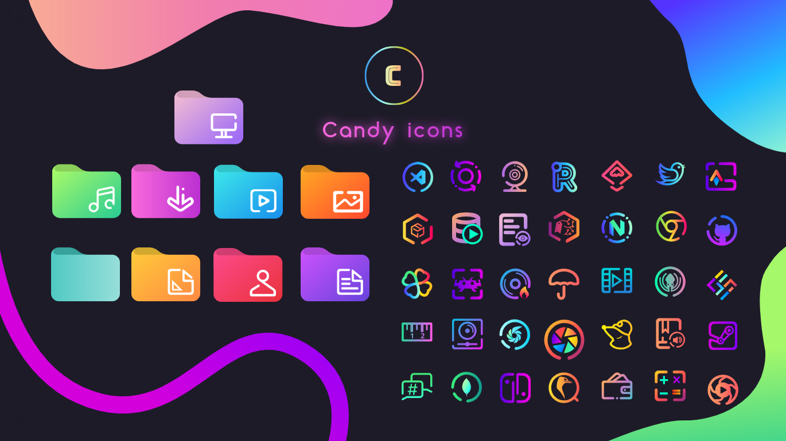
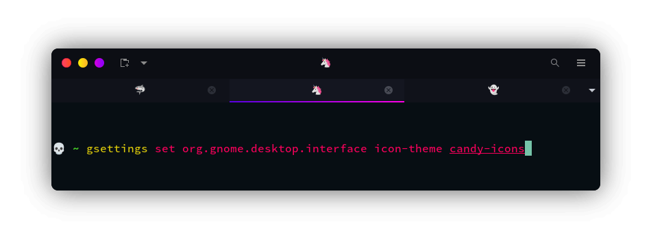
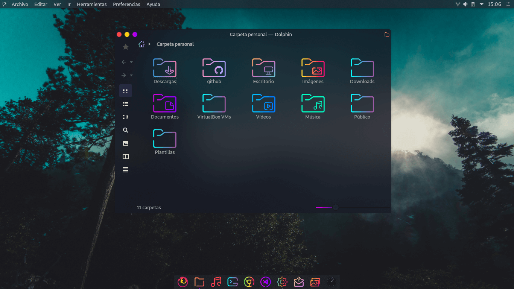

>An icon theme colored with sweet gradients

## Installation

- Download the `.zip` file ([directly from github](https://github.com/EliverLara/candy-icons/archive/refs/heads/master.zip) or from [gnome-look](https://www.opendesktop.org/p/1305251/)) 

- Extract the `.zip` file to the icons directory i.e. `/usr/share/icons/`, `~/.local/share/.icons/`  or `~/.icons/` (create it if necessary).

## Usage

To set the theme in Gnome, run the following commands in Terminal:

or Change via distribution specific `tweak-tool`.

## Previews

You can also combine this icon pack with [sweet-folders](https://github.com/EliverLara/Sweet-folders) to get an awesome custom experience:

