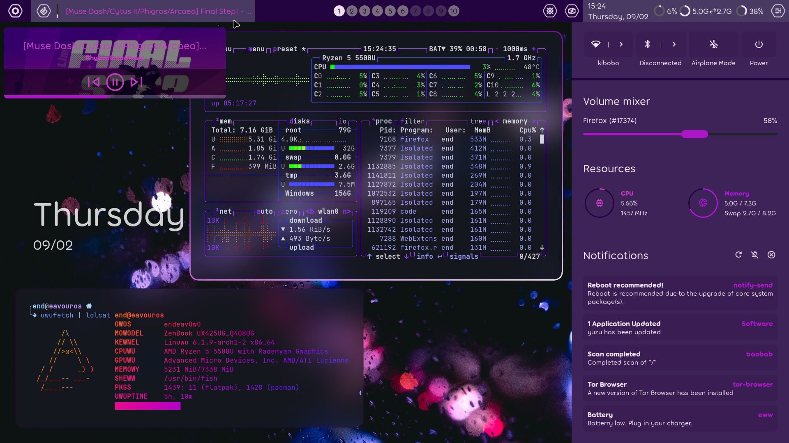

<div align="center">
    <h1>[ end-4/dots-hyprland ]</h1>
    <h3></h3>
</div>

 - _Please note that Hyprland doesn't have an "e" in the name tyty_
 - This dynamic, pywal-powered rice changes colors/wallpapers often, it might be different to the preview
 - Thanks fufexan (who also thanks a lot more people) for their guidance and eww config: https://github.com/fufexan/dotfiles <-- very clean, i stole from there :) 
 - Kinda hacky code, uses px for styling 
 - Menus are animated (in a hacky way)

# Branches
 - [Current main style: osu!lazer, updated in main branch. All non-main branches are archives.]
 - osu!lazer https://github.com/end-4/dots-hyprland/tree/osu!lazer
 - linage https://github.com/end-4/dots-hyprland/tree/linage

# Previews
 - osu!lazer
 
 - linage
 

# If you're here only for eww...
 - `monitor=eDP-1, addreserved, `y`, 0, 0, 0` (replace "eDP-1" with your monitor name) (`y=53` for osu!lazer branch, `y=32` for linage branch)
 - Start with `eww open bar && eww open bg-decor` (or put the config somewhere and source it)
 - For linage branch, also run: `eww open barbg`
 - See "Further eww instructions" below for how to use it efficiently

# Instructions
 - **Backup if you need**
 - Copy `Pictures`, `.config`, `.local` to home folder
 - Copy `Binaries` to a $PATH, (don't replace if asked (unecessary))
 - gnome-text-editor themes: Structured like root, not home (you can ask gnome devs why it's stored there don't ask me)
 - **Install font: Product Sans** (for linage branch)
 - Get "Plasma Browser Integration" extension for your browser (for media player to display properly)
 - Install stuff to provide missing commands (list below) 

# Further eww instructions
 - Music control on the music button: Middle-click for Play/Pause, Right-click for Next track
 - Scroll the top-right/top-left corner to change volume
 - To open Workspace Overview, run `eww open overview` or middle-click the workspace indicators (or press Super+Tab if you use my Hyprland configs)

# Python Dependencies
 - Command
```
pip install pywal desktop_entry_lib
```
# Other Dependencies (install it with your distro's package manager)
 - Package names (may vary)
```
bc blueberry bluez coreutils dunst findutils gawk gojq imagemagick light networkmanager networkmanagerapplet pavucontrol plasma-browser-integration playerctl procps pulseaudio ripgrep socat udev upower util-linux wget wireplumber wlogout wofi
```
 - For Fedora, run:
```
sudo dnf install bc blueberry bluez coreutils dunst findutils gawk gojq ImageMagick light NetworkManager network-manager-applet pavucontrol plasma-browser-integration playerctl procps ripgrep socat udev upower util-linux wget wireplumber wlogout wofi
```

# Other cool stuff
 `tesseract`
