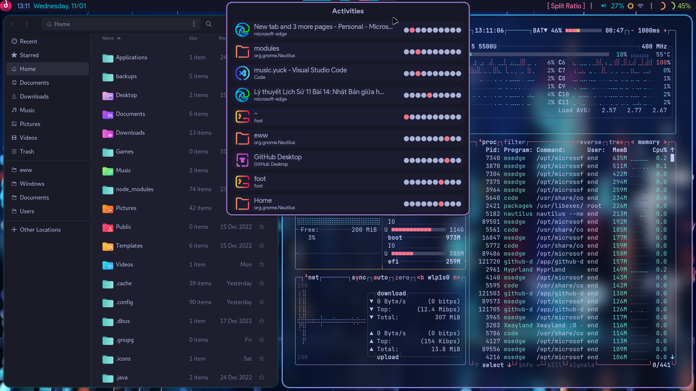

# dots-hyprland
 - Thanks to fufexan (who also thanks a lot more people) for the eww config: https://github.com/fufexan/dotfiles
 - LinageOS icons are cool
 - Run `eww open bar` to open the bar, if you decide to only use my eww configs

 

# instructions
 - Backup if u need
 - Copy `Pictures`, `.config` to home folder
 - Copy `Binaries` to a $PATH
 - Install stuff to provide missing commands (ughhhh)
 - About the `./config/eww/scripts/cache` folder: delete contents to refresh icon, do NOT delete the folder

# fedora
 - eww
 `sudo dnf install gojq socat`
 - others
 `sudo dnf install tesseract`
