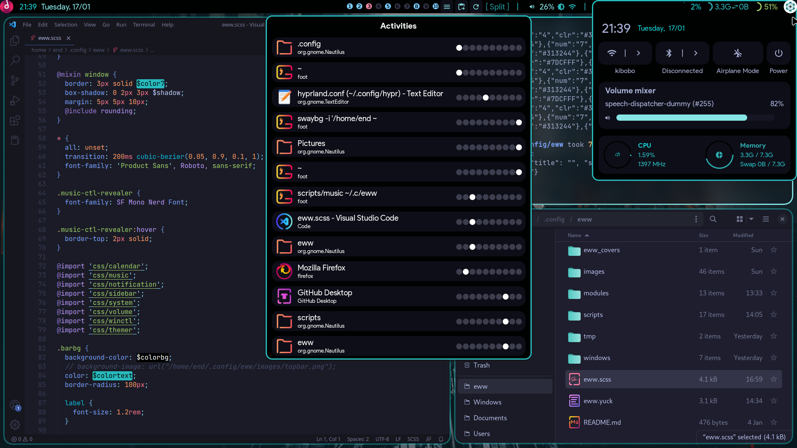

# dots-hyprland 
 - _Please note that Hyprland doesn't have an "e" in the name_
 - Thanks fufexan (who also thanks a lot more people) for their eww config: https://github.com/fufexan/dotfiles (cleaner than mine, but no color loader (yet?))

# If you're here only for eww...
 - `monitor=eDP-1, addreserved, 32, 0, 0, 0` (replace "eDP-1" with your monitor name)
 - Start with `eww open bar && eww open barbg`
 - Use a Chromium browser? Get "Plasma Browser Integration".

# Screenshots
  
 

# Instructions
 - Backup if u need
 - Copy `Pictures`, `.config` to home folder
 - Copy `Binaries` to a $PATH
 - Install stuff to provide missing commands (ughhhh)
 - About the `./config/eww/scripts/cache` folder: delete contents to refresh icon, don't delete the folder

# Dependencies
```
    bc blueberry bluez coreutils dunst findutils gawk gojq imagemagick light networkmanager networkmanagerapplet (network-manager-applet on fedora) pavucontrol playerctl procps pulseaudio ripgrep socat udev upower util-linux wget wireplumber wlogout wofi
```


# For Fedora (incomplete list, ignore)
 - eww
 `sudo dnf install gojq socat`
 - others
 `sudo dnf install tesseract plasma-browser-integration`
