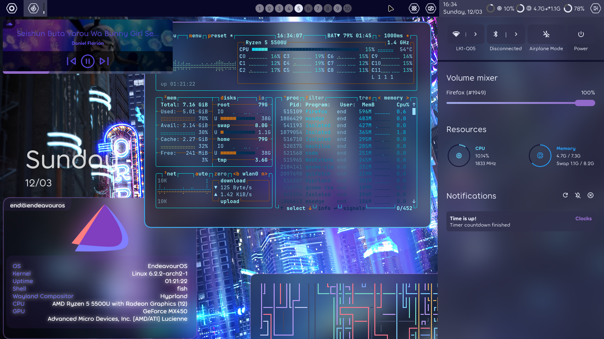

<div align="center">
    <h1>[ end-4/dots-hyprland ]</h1>
    <h3></h3>
</div>

<div align="center">


[](https://github.com/end-4/hyprland)
</a>

</div>

 - _Please note that Hyprland doesn't have an "e" in the name tyty_
 - This dynamic, pywal-powered rice may changes colors/wallpapers often, but the bar layout should be similar to the preview
 - Thanks fufexan (who also thanks a lot more people) for their guidance and eww config: https://github.com/fufexan/dotfiles (very clean implementation, my config is based on this)

# Branches
 - [ Current main style: Material, updated in main branch. All non-main branches are archives. ]
 - Material https://github.com/end-4/dots-hyprland/tree/material
 - osu!lazer https://github.com/end-4/dots-hyprland/tree/osu!lazer
 - linage https://github.com/end-4/dots-hyprland/tree/linage

# Screenshots
- Material
 
 - osu!lazer
 
 - linage
 

# General instructions
 - **Backup if you need**
 - Copy `Pictures`, `.config`, `.local` to home folder
 - Copy `Binaries` to a $PATH, (do NOT replace if asked)
 - gnome-text-editor themes: Structured like root, go inside and copy...
 - Install font Product Sans (for linage branch)
 - Get "Plasma Browser Integration" extension for your browser (for media player to display properly)
 - Install stuff to provide missing commands (list below) 

# eww instructions
 - Start eww with `eww daemon && eww open bar && eww open bg-decor`
 - For linage branch, also run: `eww open barbg`
 - -=-=-=- notes for usage -=-=-=-
 - Music control on the music button and on topleft corner: Middle-click for Play/Pause, Right-click for Next track, scroll to change volume
 - To open the Overview, middle/right-click the workspace indicators or run `eww open overview`

# Dependencies
 - Python
```
[ Command ]
pip install pywal desktop_entry_lib
```
 - Other Dependencies (install it with your distro's package manager)
```
[ Possible package names ]
bc blueberry bluez coreutils dunst findutils gawk gojq imagemagick light networkmanager networkmanagerapplet pavucontrol plasma-browser-integration playerctl procps pulseaudio ripgrep socat udev upower util-linux wget wireplumber wlogout wofi qalc sox
[ Command for: Fedora ]
sudo dnf install bc blueberry bluez coreutils dunst findutils gawk gojq ImageMagick light NetworkManager network-manager-applet pavucontrol plasma-browser-integration playerctl procps ripgrep socat udev upower util-linux wget wireplumber wlogout wofi qalc
```
- AUR Packages (ughhh why not arch?) (check their AUR pages and check the Upstream URL for their repos)
```
[ yay as AUR helper ]
yay -S python-material-color-utilities geticons
```
 - Other cool stuff that I use
```
tesseract
```
