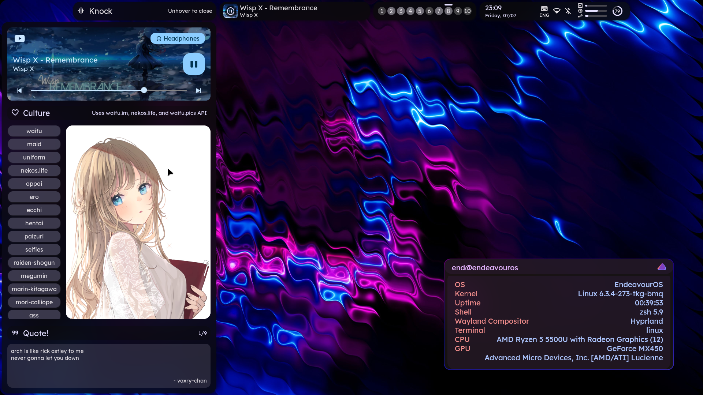
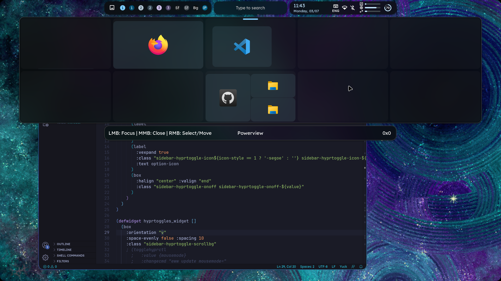
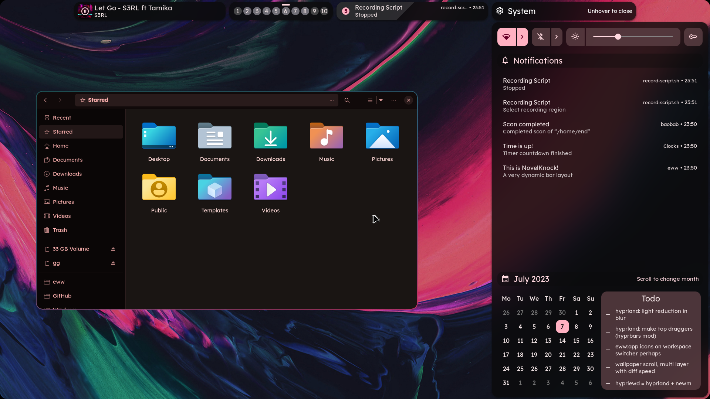
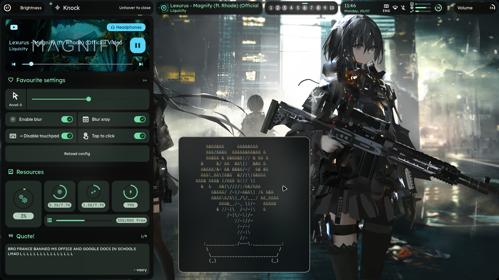
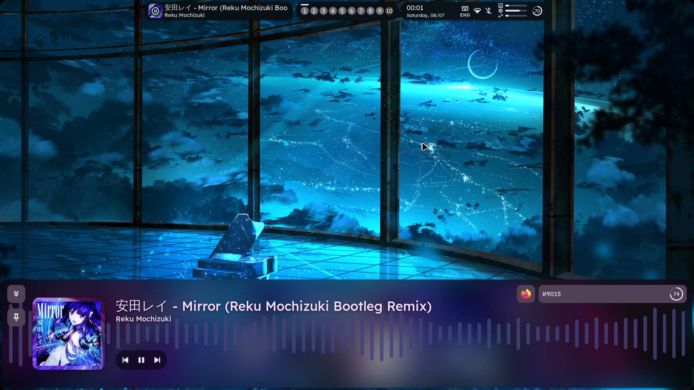

<div align="center">
    <h1>[ end-4/dots-hyprland > NovelKnock ]</h1>
    <h3> A polished Linux experience. </h3>
</div>

## Description
- A new approach to the status bar:
  - **Only shows what you need.** Does not try to fit everything on the screen at once.
  - **Flexible.** Scrollable modules. Automatically scrolls to notifications module when there's a new one. Bar moves when sidebar is opened.
  - **Funciton AND form.** Floating bar, but you can still click the topmost pixel.
  - **OSDs done right.** Volume and Brightness indicators are shown on the topleft and topright corners. They don't block your windows or other bar components.
- A comfortable experience:
  - Easy on the eyes: uses Material You colors and natural animation curves
  - Random anime girl from 3 public APIs ~~(segs too!)~~

---

- **_the end of the inspiring feature list, there's the preview you should not miss!_**
- **_feel like giving this a go? see the dependencies below!_**

## Gallery
- [Video of (almost) everything](https://streamable.com/7vo61k)







## Dependencies
 - See the main branch for [general dependencies](https://github.com/end-4/dots-hyprland#-dependencies), then install the following:
    - [eww with trigonometric functions](https://github.com/elkowar/eww/pull/823). If the PR hasn't been merged, you should clone my branch and compile it.
 - Python dependencies
```
pywal desktop_entry_lib poetry build Pillow
```
 - Normal dependencies
```
[ Possible package names (tries to match Arch) ]
bc blueberry bluez boost boost-libs coreutils curl findutils fzf gawk gnome-control-center ibus imagemagick libqalculate light networkmanager network-manager-applet nlohmann-json pavucontrol plasma-browser-integration playerctl procps ripgrep socat sox udev upower util-linux xrandr wget wireplumber yad
[ Command for: Fedora (INCOMPLETE command so there's less name hunting for you) ]
sudo dnf install bc blueberry bluez coreutils dunst findutils gawk gojq ImageMagick light NetworkManager network-manager-applet pavucontrol plasma-browser-integration playerctl procps ripgrep socat swayidle udev upower util-linux wget wireplumber wl-clipboard wlogout qalc sox nlohmann-json-devel
```
- AUR Packages
```
cava geticons gtklock gtklock-playerctl-module gtklock-powerbar-module gtklock-userinfo-module hyprland-git python-material-color-utilities swww gojq xdg-desktop-portal-hyprland-git waybar-hyprland-git wlogout
```
- Manual setup
   - Get "Plasma browser integration" extension for your browser
   - Run `usermod -aG video <USERNAME>` for brightness control to work
 - Stuff that you might wanna install if you didn't start as a lazyass on EndeavourOS+Gnome like me (install these if you decide to use my hyprland.conf)
```
gnome-keyring polkit-gnome 
```

 - Other stuff that I use, mostly utilities (you can skip these)
```
tesseract cliphist grim slurp fuzzel
```
