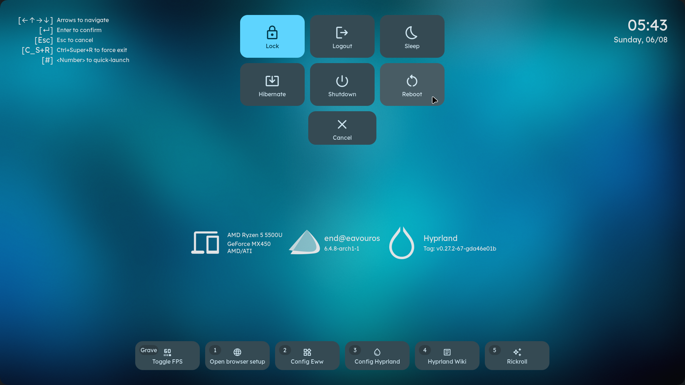

    <h1>【 end_4's Hyprland dotfiles > m3ww 】</h1>
    <h3> Material design 3 woo </h3>

## Design
- **Scalable widgets**: Just change the font size, they'll be scaled!
- **Accessible**:
  - Natural animations
  - Soft colors that still have decent contrast
  - Both light and dark mode are well supported
- **Dynamic**: autogenerated colors based on wallpaper for eww, gtklock, foot and fuzzel

## Gallery
- Video: https://streamable.com/85ch8x
- Images ↓

## Notes
- Requires [eww with systray support](https://github.com/elkowar/eww/pull/743)
- Requires hyprland-git
