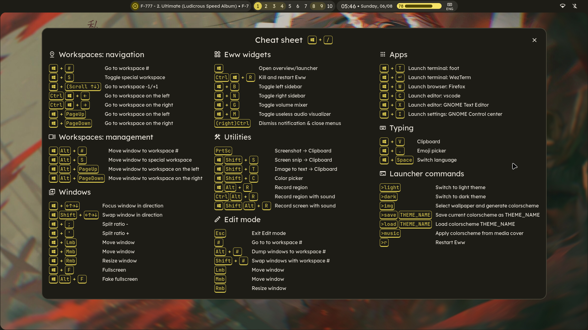
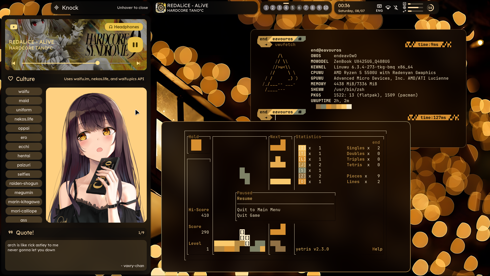
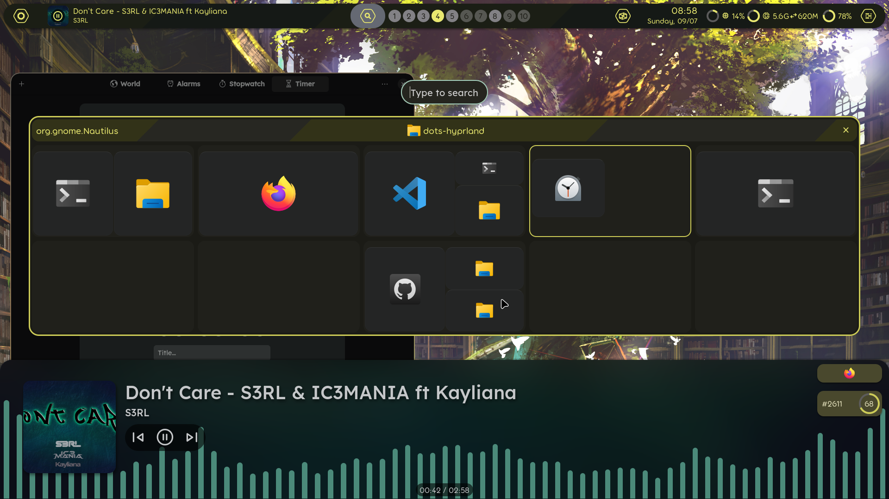
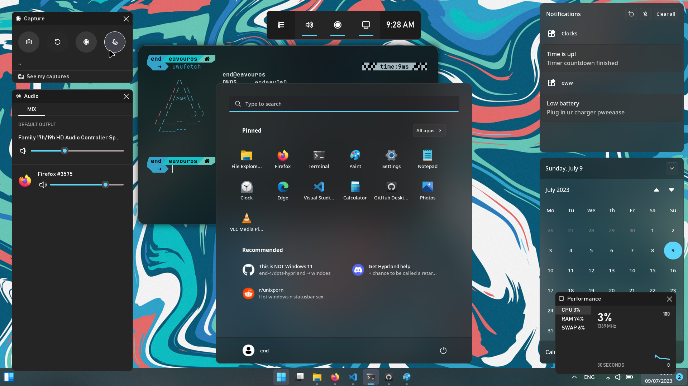

    <h1>【 end_4's Hyprland dotfiles 】</h1>
    <h3></h3>

</a>

# ✨ Cool stuff
 
 
  
Notable features

    
  - An overview widget that shows window positions in workspaces + app search (GNOME overview replacement)
  - `hybrid` branch: Can toggle Windows 11-like mode hehee

 
  
Details

    
  - Pywal and [Material You](https://m3.material.io/styles/color/the-color-system/key-colors-tones) colors
  - Sexy animations
  - The latest branch, [m3ww](https://github.com/end-4/dots-hyprland/tree/m3ww), can be scaled and supports both light and dark theme properly!

 
 
  
Bragging

     
   - [`hybrid`](https://github.com/end-4/dots-hyprland/tree/hybrid) branch is featured in [Athena OS](https://www.athenaos.org/en/configuration/hyprland/) 
   - [`summer-gruv`](https://github.com/end-4/dots-hyprland/tree/summer-gruv) branch is the winner of Hyprland ricing competition Summer 2023. Now featured in the [Hyprland repo](https://github.com/hyprwm/hyprland#gallery) and [Hyprland Wiki](https://wiki.hyprland.org/Configuring/Example-configurations/)
   - [`windoes`](https://github.com/end-4/dots-hyprland/tree/windoes) branch received a "Tasty rice" flair [on r/unixporn](https://www.reddit.com/r/unixporn/comments/13zdhqd/hyprland_windows_rice_with_too_much_eww_with_blur/)

# 👀 Styles

_Click the images for a video showcase with animations!_

### [m3ww](https://github.com/end-4/dots-hyprland/tree/m3ww)
   

### [NovelKnock](https://github.com/end-4/dots-hyprland/tree/novelknock)
   

### [Hybrid](https://github.com/end-4/dots-hyprland/tree/hybrid)
   

### [Windoes](https://github.com/end-4/dots-hyprland/tree/windoes)
   

- For older and insignificant styles, check the releases

---

# 🔧 General instructions
 - Don't download the main branch! Use one of the above listed ones.
 - **BACKUP**
 - Install dependencies. You can find the list for them in branch-specific readmes.
 - Copy
   - `Pictures`, `.config`, `.local` to home folder
   - Stuff in `Import manually` folder if you need them
 - Install proprietary font: Segoe UI Variable (for windoes and hybrid branch)
 - **For ARM users**: Compile .cpp scripts in `~/.config/eww/scripts/` (to that folder) (like this: `g++ ~/.config/ewwscripts/SCRIPTNAME.cpp -o ~/.config/eww/scripts/SCRIPTNAME`)
 
# 🎨 eww (yes I spend too much time on this)
 ## Performance
|  ⌄  | Do use | Not recommended | Notes                 |
| --- | ------ | ----------- | ------------------------- |
| Kernel |     | cachyos     | Don't abuse power savers. Also I'm not sure what bullshit I'm saying - this is just from personal experience. |
| Login shell  | bash/zsh | fish | It's okay to use fish in a terminal - that's what I do |

 ## Setup
 - This eww config only works properly in `~/.config/eww`
 - Start eww with `eww daemon`
 - To open the top bar, run `eww open bar`
 - To open the Windows bar, run `eww open winbar` (`windoes`/`hybrid` branch)
 - To open the bottom line, run `eww open bottomline` (so that the music window opens if you click the bottom edge of the screen)
 - Open the overview and wait 10 seconds (for it to generate app search cache, or icons won't show properly)
 ## Usage
 - Music controls: Middle-click for Play/Pause, Right-click for Next track, scroll to change volume
 - To open the Overview, middle/right-click the workspace indicators or run `eww open overview`
 - You can type to search in overview!
 ## Search
 - Type normally to search apps
 - Type something beginning with a number and it'll be calculated (`qalc` is used for backend)
 - `>save THEME`: Saves current colorscheme, with THEME as the name.
 - `>load THEME`: Loads a saved theme. Available themes will be shown as you type.
 - `>music`: Get colorscheme from current media thumbnail
 - `>wall`: Get colorscheme from wallpaper located in `~/.config/eww/images/wallpaper/wallpaper` (might take quite a while)
 - `>light`: Remember to use light mode for next color generations
 - `>dark`: Remember to use dark mode for next color generations
 - `>one`: Remember to use only one color for bar icons for next color generations
 - `>multi`: Remember to use many colors for bar icons for next color generations
 - `>r`: Reload (kills and relaunches eww with the default bar)

---

# 🙏 Attribution
 - Thank you fufexan (who also thanks a lot more people) for their guidance and eww config: https://github.com/fufexan/dotfiles (very clean implementation, my config is based on this)
 - Thanks to the people at the Hypr Development Discord for their inspiration
 - Bing AI for helping me code like 80% of the C++ functions lmao
 - Maybe more, but I might not remember them all.. Still, thanks.

# 🌟 Stars
- _A star really makes my day! Thanks!_

# 💡 Some inspirations
 - osu!lazer, Windows 11, Material Design 3, AvdanOS (concept)

