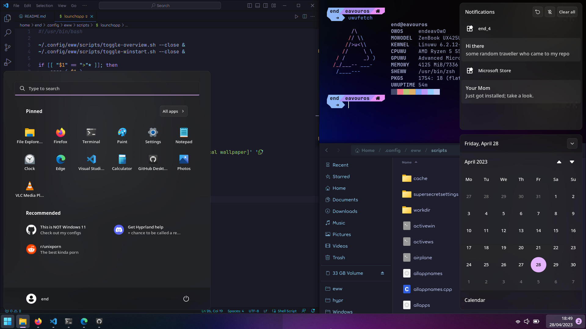
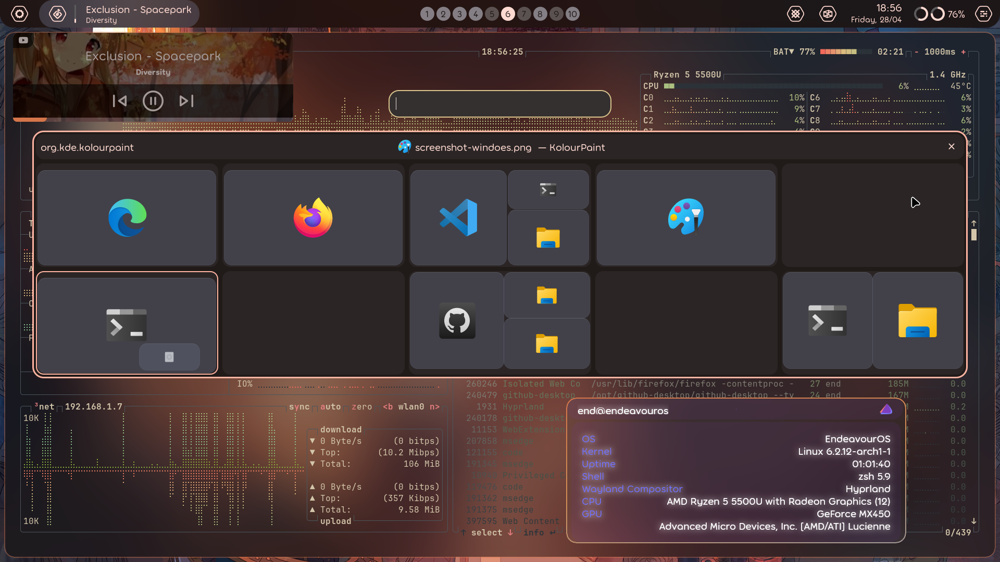
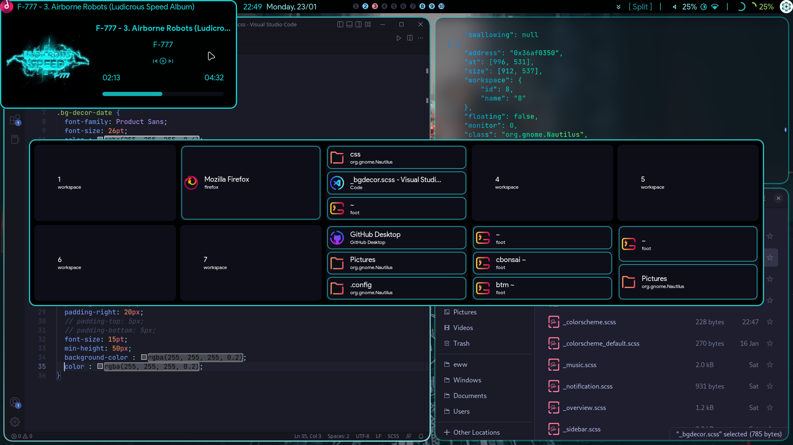
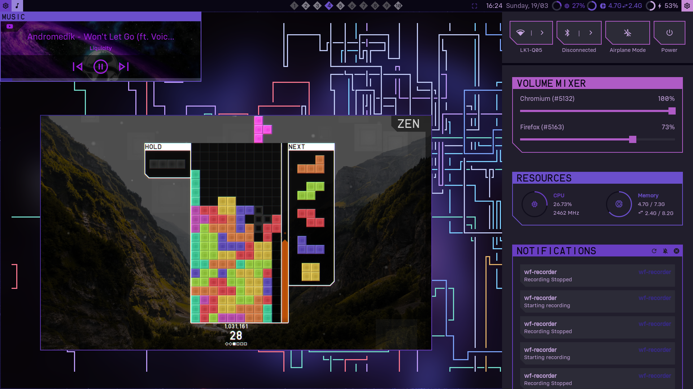

<div align="center">
    <h1>[ end-4/dots-hyprland ]</h1>
    <h3></h3>
</div>

<div align="center">


[](https://github.com/end-4/hyprland)
</a>

</div>


# Main features
 - An overview widget that shows window positions in workspaces (and has an app search! gnomie!!!1!1!!)
 - Can toggle Windows 11-like mode hehee
 - Powered by Pywal and Material You
 - Sexy animations
 - A rice made by a literal Asian

# Branches + Screenshots

<details> 
  <summary> Current main style: Material/Windows, updated in main branch. All non-main branches are archives. </summary>
  - Nothing here :P, check the ones below
</details>

<details open> 
  <summary>Material/Windows https://github.com/end-4/dots-hyprland/tree/windoes </summary>
  
   
</details>

<details open> 
  <summary>Material https://github.com/end-4/dots-hyprland/tree/material </summary>
  
   
</details>

<details> 
  <summary>osu!lazer https://github.com/end-4/dots-hyprland/tree/osu!lazer </summary>
  
   
</details>

<details> 
  <summary>linage https://github.com/end-4/dots-hyprland/tree/linage </summary>
  
   
</details>

<details> 
  <summary>Tetrio https://github.com/end-4/dots-hyprland/tree/tetrio </summary>
  
   
</details>

# General instructions
 - **Backup if you need**
 - Copy `Pictures`, `.config`, `.local` to home folder
 - Copy `execs` to a $PATH
 - gnome-text-editor themes: Structured like root, go inside and copy...
 - Install font Product Sans (for linage branch), Segoe UI Variable (for the main and Windows branch)
 - Get "Plasma Browser Integration" extension for your browser (for media player to display properly)
 - Install stuff to provide missing commands (list below) 
 
# eww (yes I spend too much time on this)
 ## Performance
|     | Do use | Do not use! | Notes |
| --- | ------ | ----------- | ----- |
| Kernel | Zen or vanilla | XanMod | From my experience in EndeavourOS |
| Login shell | bash or zsh | fish | It's okay to use fish for your terminal, it's what I do |

 ## Setup
 - This eww config only works in `~/.config/eww`
 - Start eww with `eww daemon`
 - To open the top bar, run `eww open bar` (for linage branch, also run: `eww open barbg`)
 - To open the Windows bar, run `eww open winbar`
 - Open the overview and wait 10 seconds (for it to generate app search cache, or icons won't show properly)
 ## Usage
 - Music control with the leftmost button of bars: Middle-click for Play/Pause, Right-click for Next track, scroll to change volume
 - To open the Overview, middle/right-click the workspace indicators or run `eww open overview`
 - You can type to search in overview!
 ## Overview/Search usage
 - Type normally to search apps
 - Type something beginning with a number and it'll be calculated (`qalc` is used for backend)
 - `>save THEME`: Saves current colorscheme, with THEME as the name.
 - `>load THEME`: Loads a saved theme. Available themes will be shown as you type.
 - `>music`: Get colorscheme from current media thumbnail
 - `>wall`: Get colorscheme from wallpaper located in `~/.config/eww/images/wallpaper/wallpaper` (might take quite a while)
 - `>light`: Remember to generate light theme for future schemes
 - `>dark`: Remember to generate dark theme for future schemes
 - `>r`: Reload (runs `eww reload`)

# Dependencies
 - Python
```
[ Command ]
pip install pywal desktop_entry_lib
```
 - Other Dependencies (install it with your distro's package manager)
```
[ Possible package names ]
bc blueberry bluez coreutils dunst findutils gawk gojq imagemagick light networkmanager networkmanagerapplet pavucontrol plasma-browser-integration playerctl procps pulseaudio ripgrep socat udev upower util-linux wget wireplumber wlogout wofi qalc sox nlohmann-json
[ Command for: Fedora ]
sudo dnf install bc blueberry bluez coreutils dunst findutils gawk gojq ImageMagick light NetworkManager network-manager-applet pavucontrol plasma-browser-integration playerctl procps ripgrep socat udev upower util-linux wget wireplumber wlogout wofi qalc sox nlohmann-json-devel
```
- AUR Packages (ughhh why not arch?) (check their AUR pages and check the Upstream URL for their repos)
```
[ yay as AUR helper ]
yay -S python-material-color-utilities geticons gtklock-runshell-module gtklock-playerctl-module gtklock-powerbar-module gtklock-userinfo-module eww-wayland
```
 - Other cool stuff that I use (you can skip these if you don't know what they are)
```
tesseract
```

# Attribution
 - Thank you fufexan (who also thanks a lot more people) for their guidance and eww config: https://github.com/fufexan/dotfiles (very clean implementation, my config is based on this)
 - Thanks to the people at the Hypr Development Discord for their inspiration (some might be toxic sometimes, but not always)
 - Bing AI for helping me breeze through the process of learning libraries
 - Maybe more, but I don't remember it all.. thanks anyway

# Some inspirations
 - osu!lazer
 - Windows 11
 - Material 3
 - Valorant's download indicator _(yes seriously xD)_
 - TETR.IO (web game) (tetrio branch)
 - LinageOS (linage branch)
