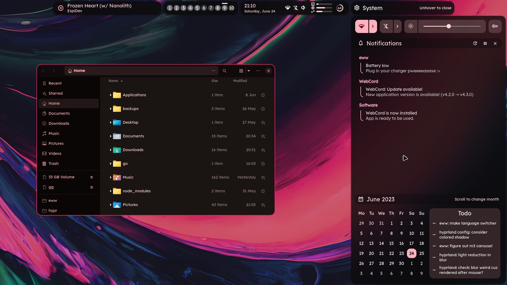

    <h1>[ end-4/dots-hyprland > NovelKnock ]</h1>
    <h3> A polished Linux experience. </h3>

## Notes before release
- requires new hyprland (maybe wait for next release)
- requires [eww pr to add trigonometry funcs](https://github.com/elkowar/eww/pull/823)
---

## Oh look a preview

