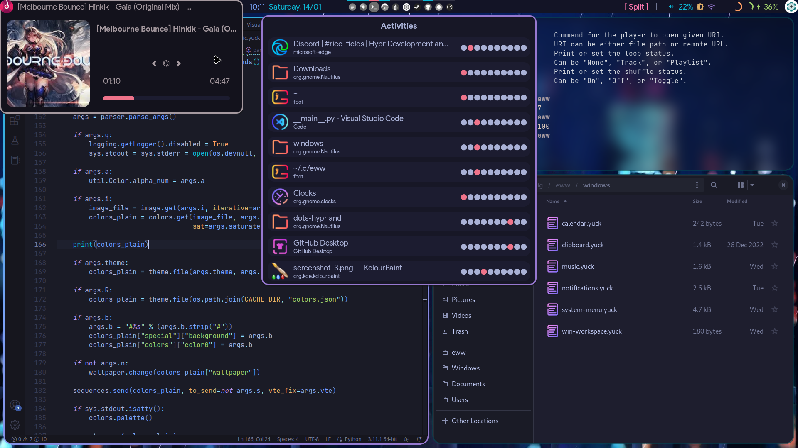
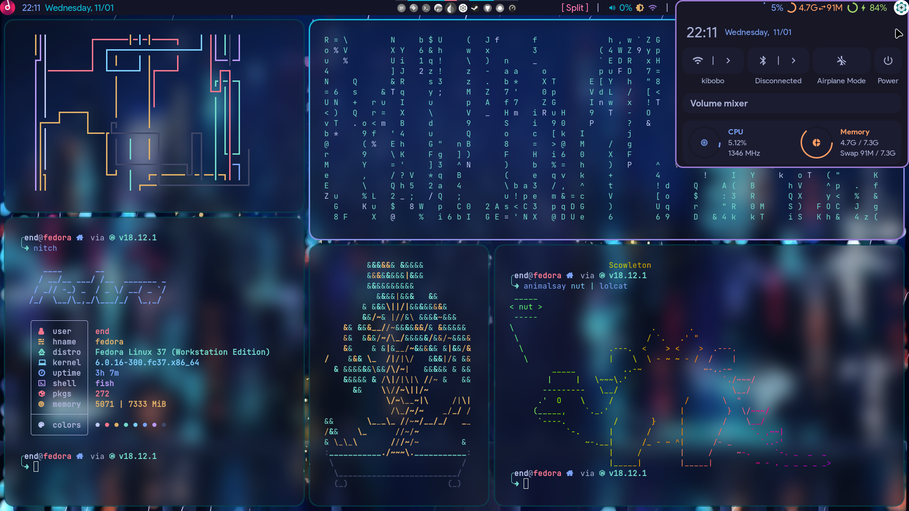

# dots-hyprland 
 - _Please note that Hyprland doesn't have an "e" in the name_
 - Thanks to fufexan (who also thanks a lot more people) for their eww config: https://github.com/fufexan/dotfiles

# If you're here only for eww...
 - `monitor=eDP-1, addreserved, 32, 0, 0, 0` (replace "eDP-1" with your monitor name)
 - Start the bar with `eww open bar` and `eww open barbg`
 - If you use a Chromium-based browser (Brave Chrome Edge etc), Plasma Browser Integration is your friend (if you use Youtube for music like me)

# Screenshots
  
 

# Instructions
 - Backup if u need
 - Copy `Pictures`, `.config` to home folder
 - Copy `Binaries` to a $PATH
 - Install stuff to provide missing commands (ughhhh)
 - About the `./config/eww/scripts/cache` folder: delete contents to refresh icon, do NOT delete the folder

# For Fedora
 - eww
 `sudo dnf install gojq socat`
 - others
 `sudo dnf install tesseract plasma-browser-integration`
