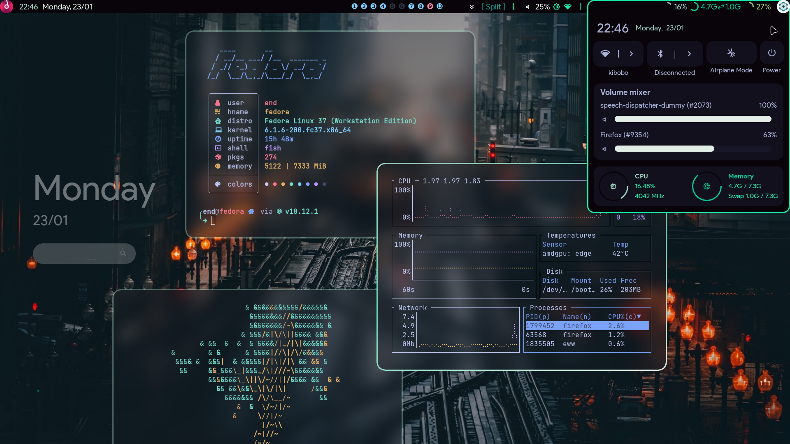

<div align="center">
    <h1>[ end-4/dots-hyprland ]</h1>
    <h3></h3>
</div>

 - _Please note that Hyprland doesn't have an "e" in the name tyty_
 - Thanks fufexan (who also thanks a lot more people) for their eww config: https://github.com/fufexan/dotfiles <-- very clean, i stole from there :)

# If you're here only for eww...
 - `monitor=eDP-1, addreserved, 32, 0, 0, 0` (replace "eDP-1" with your monitor name)
 - Start with `eww open bar && eww open barbg` (or put the config somewhere and source it)
 - See instructions below for how to use it efficiently
 

# Previews
 
 

# Instructions
 - **Backup if you need**
 - Copy `Pictures`, `.config`, `.local` to home folder
 - Copy `Binaries` to a $PATH, (don't replace if asked (unecessary))
 - gnome-text-editor themes: Copy that folder to root if ya need (you can ask gnome devs why it's stored there don't ask me)
 - **Install font: Product Sans** (or change the font in `./.config/eww/eww.scss` to another font)
 - Get "Plasma Browser Integration" extension for your browser (for media player to display properly)
 - Install stuff to provide missing commands (list below) 

# Further eww bar instructions
 - Music icon: Middle-click: Play/Pause, Right-click: Next track, Left-click: Open music controls
 - Scroll the top-right/top-left corner to change volume
 - To open Workspace Overview, run `eww open overview` (or press Super+Tab if you use my Hyprland configs)

# Dependencies
```
    bc blueberry bluez coreutils dunst findutils gawk gojq imagemagick light networkmanager networkmanagerapplet (network-manager-applet on fedora) pavucontrol plasma-browser-integration playerctl procps pulseaudio ripgrep socat udev upower util-linux wget wireplumber wlogout wofi
```

# Other cool stuff
 `tesseract`